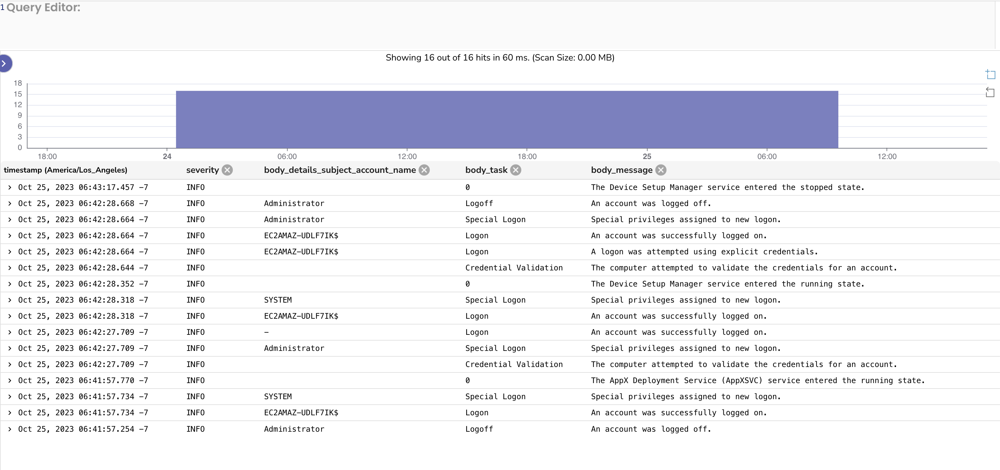

# Agents

Scripts that configure and install the Open Observe agent on various platforms.

## Linux

### Install

```bash
wget https://raw.githubusercontent.com/openobserve/agents/main/linux/install.sh && chmod +x install.sh && sudo ./install.sh {URL} {authorization_token}
```

e.g.

```bash
wget https://raw.githubusercontent.com/openobserve/agents/main/linux/install.sh && chmod +x install.sh && sudo ./install.sh https://api.openobserve.com/api/your_org/ cm9vdEBleGFtcGxlLmNvbTpDb21wbGV4cGFzcyMxMjM=
```

### Uninstall

```bash
wget https://raw.githubusercontent.com/openobserve/agents/main/linux/uninstall.sh && chmod +x uninstall.sh && sudo ./uninstall.sh
```

## Windows

### Install

You need minimum PowerShell 6 to run the install script. you can check your PowerShell version by running `$PSVersionTable.PSVersion` in your terminal.

You should see something like this:

```powershell
PS C:\> $PSVersionTable.PSVersion

Major  Minor  Patch  PreReleaseLabel BuildLabel
-----  -----  -----  --------------- ----------
7      3      7
```

Major should be at least 6.

You can download and install the latest version of powershell from [here](https://learn.microsoft.com/en-us/powershell/scripting/install/installing-powershell-on-windows)

From powershell terminal:

```powershell
Invoke-WebRequest -Uri https://raw.githubusercontent.com/openobserve/agents/main/windows/install.ps1 -OutFile install.ps1 ; .\install.ps1 -URL <URL> -AUTH_KEY <Authorization_Key>
```

e.g.

```powershell
Invoke-WebRequest -Uri https://raw.githubusercontent.com/openobserve/agents/main/windows/install.ps1 -OutFile install.ps1 ; .\install.ps1 -URL https://localhost:5080/api/default -AUTH_KEY cm9vdEBowWjJSanhscWtSbVB5S0VE
```

Now run `services.msc` and start the `otel-collector service` service.



### Uninstall

```powershell
Invoke-WebRequest -Uri https://raw.githubusercontent.com/openobserve/agents/main/windows/uninstall.ps1 -OutFile uninstall.ps1 ; .\uninstall.ps1
```

## MacOS

## Install

## Uninstall
